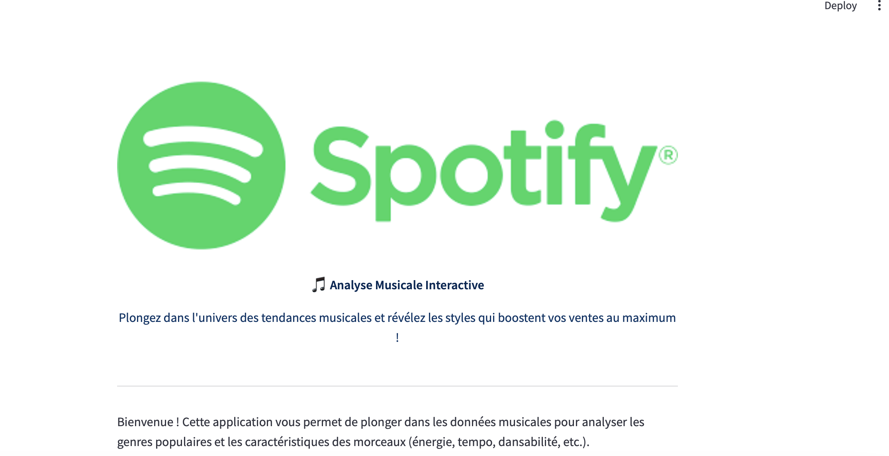
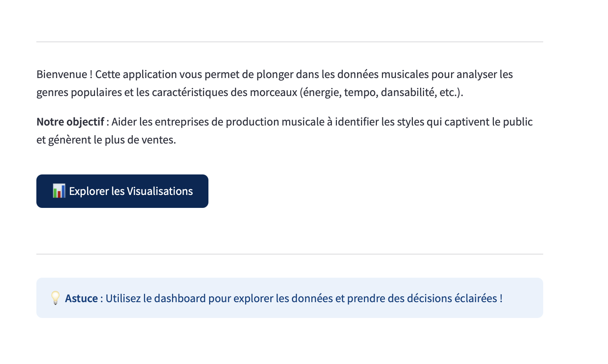
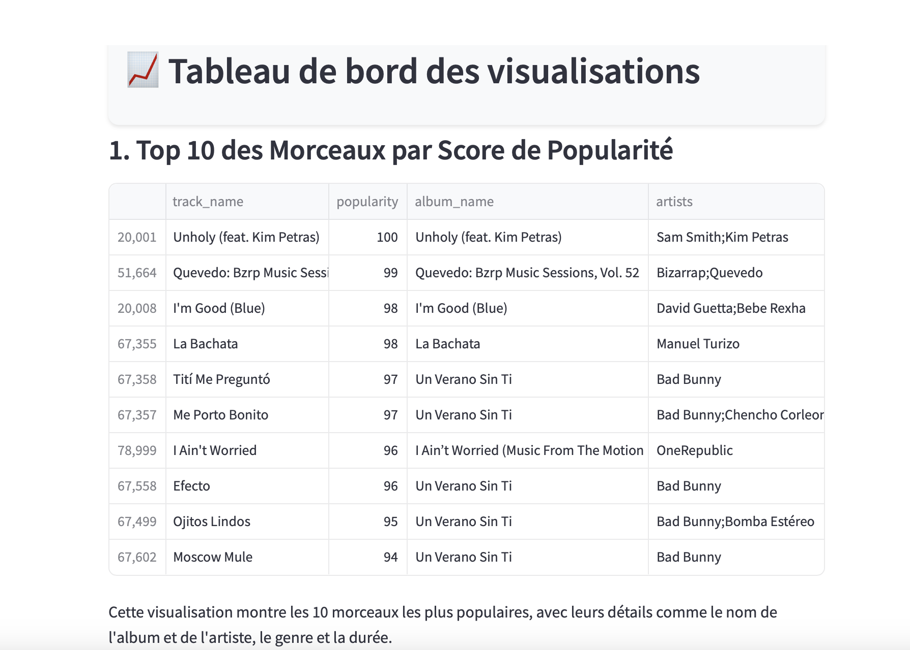
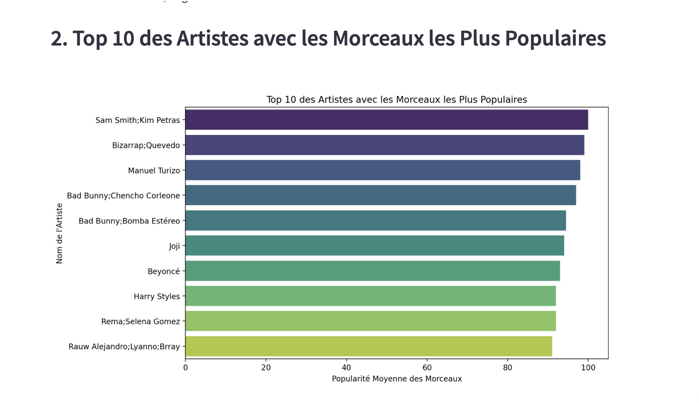
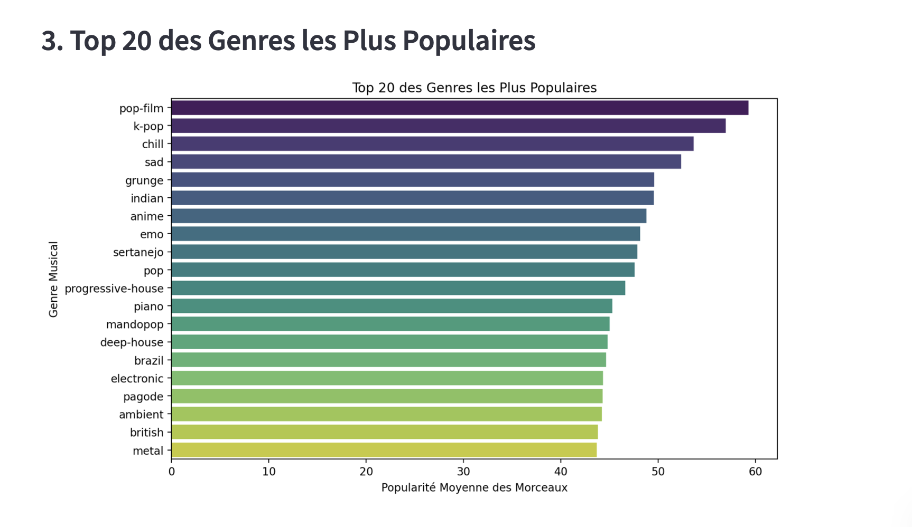
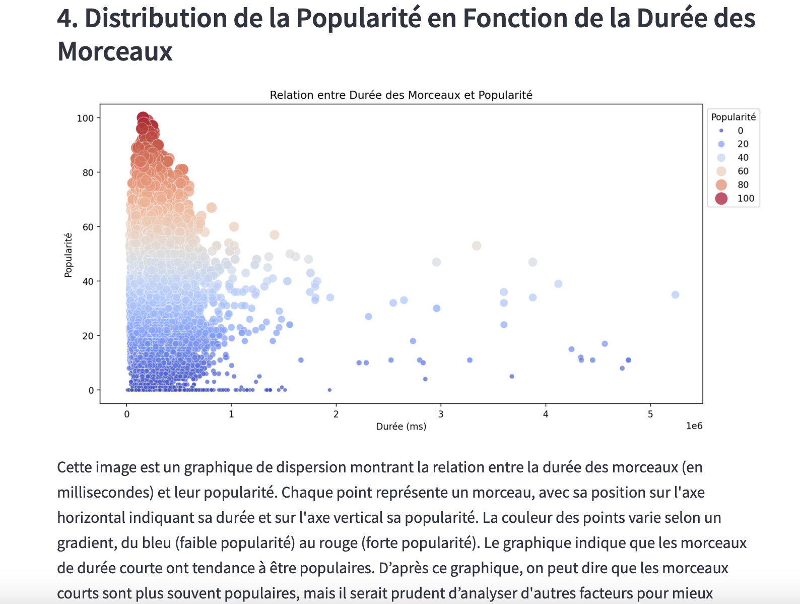
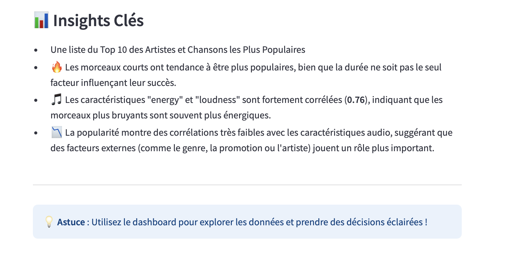

# **Spotify Music Data Analysis Project**

Ce projet analyse des données musicales de Spotify afin de visualiser et d'interpréter diverses métriques comme la popularité des morceaux, des artistes et des genres. Il inclut des visualisations interactives réalisées avec **Streamlit** et des graphiques à l'aide de **Seaborn** et **Matplotlib**.

Ce projet permet d'analyser un jeu de données de morceaux Spotify en affichant des visualisations interactives et détaillées sur :

- La popularité des morceaux
- Les artistes les plus populaires
- Les genres musicaux les plus populaires
- La relation entre la durée des morceaux et leur popularité
- La corrélation entre différentes caractéristiques des morceaux

Il utilise **Streamlit** pour l'interface utilisateur et **Seaborn/Matplotlib** pour la génération de graphiques.

---

## **Description du Projet**

Ce projet analyse des données extraites de Spotify. Il fournit des visualisations interactives pour permettre une exploration approfondie des morceaux, genres, artistes et leur popularité. Les graphiques générés permettent une meilleure compréhension des tendances musicales actuelles, notamment en explorant les relations entre la durée des morceaux et leur popularité, ou encore la popularité des genres musicaux.

---

## **Installation**

### **Cloner le projet**

Pour commencer, clonez ce projet sur votre machine locale :

```bash
git clone https://votre-lien-de-projet.git
```

Installer les dépendances
```bash
pip install -r requirements.txt
```

Lancer le projet avec Streamlit
```bash
streamlit run app.py
```

#### Fichier CSV des Données Spotify :

Le projet utilise un fichier CSV des morceaux Spotify. Assurez-vous que le fichier **spotify_tracks_cleaned.csv** se trouve dans le répertoire **data/.** Si vous avez un fichier CSV différent, vous pouvez mettre à jour le chemin dans le code en conséquence.


##### Aperçu du Site

###### 1. Page d’Accueil
Voici une vue d’ensemble de la page d’accueil avec les options de visualisation interactive.




###### 2. Top 10 des Morceaux par Popularité
Un aperçu des morceaux les plus populaires affichés dans une table.



###### 3. Top 10 des Artistes par Popularité
Un aperçu des artistes les plus populaires représentés dans un plot.



###### 5. Top 20 des Tracks Genres par Popularité
Un aperçu des genres les plus populaires représentés dans un plot.



Il exitse aussi d'autres plots. 



Et pour finir, un résumé à la fin avec les insights clés.



